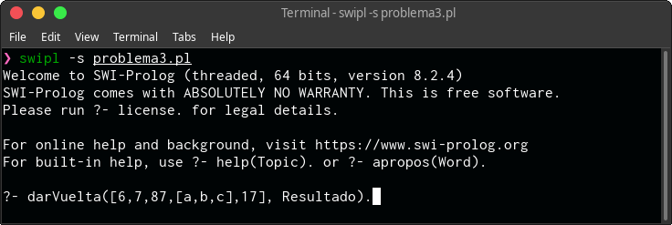
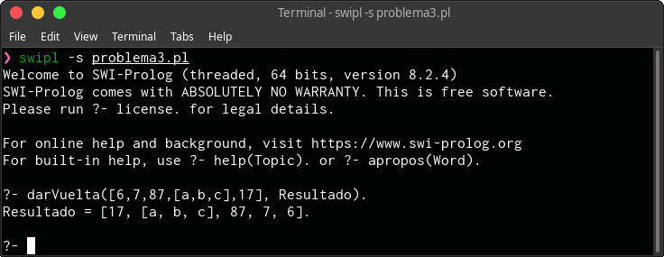
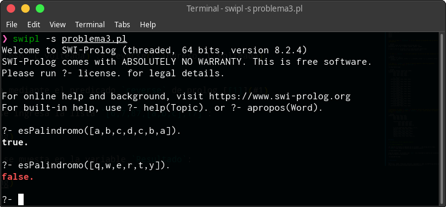
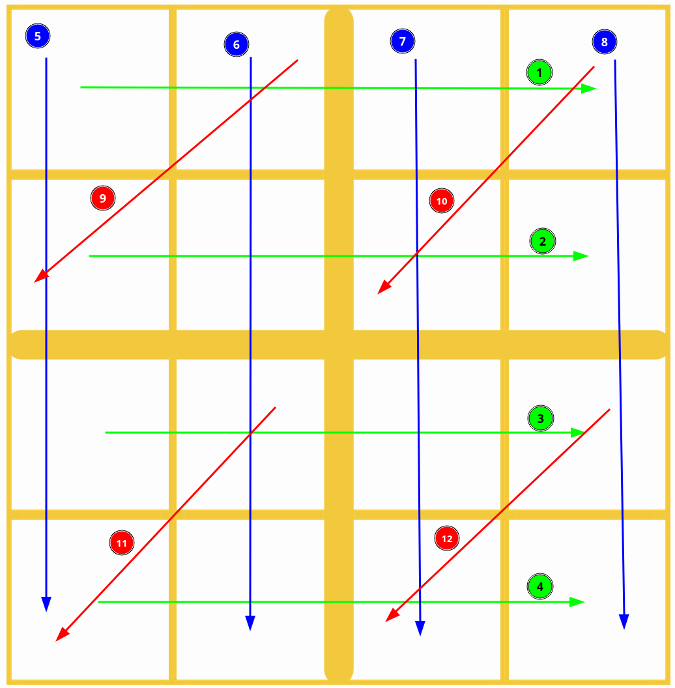
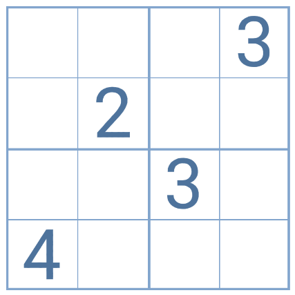
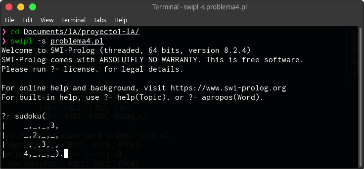
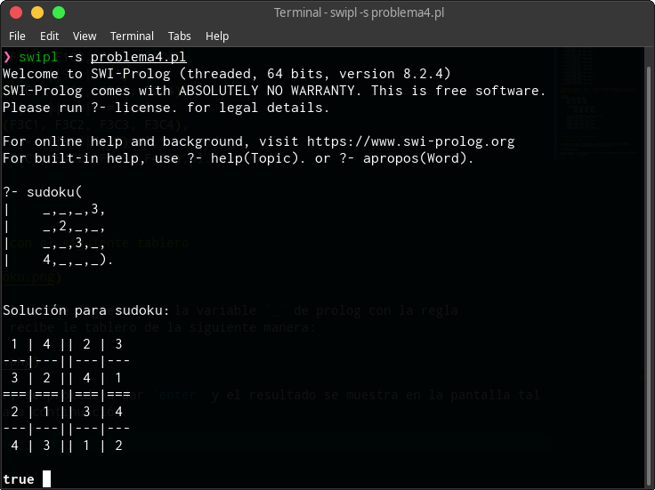

# Inteligencia Artificial 1

|Proyecto 1|7 septiembre 2021|
|:--:|:--:|
|201504051|Asunción Mariana Sic Sor|

# Tabla de Contenido

* [Problema 1](#problema-1)
    * [Descripción del Problema](#descripción-del-problema)
    * [Solución](#solución)
* [Problema 3](#problema-3)
    * [Reverso de lista](#reverso-de-lista)
    * [Palíndromo](#palíndromo)
    * [Duplicar Lista](#duplicar-lista)
    * [División en dos listas](#división-en-dos-listas)
    * [Insertar en lista](#insertar-en-lista)
* [Problema 4](#problema-4)
    * [Descripción](#descripción)
    * [Solución de Sudoku](#solución-de-sudoku)
    * [Sudoku](#sudoku)
* [Referencias](#referencias)

# Problema 1

## Descripción del problema

La policía de Gotham está investigando el asesinato a mano armada de Marta. Una madre que tenía 4 hijos, todos ellos con hijos sumando 9 nietos en total.

La hermana de el/la culpable tenía sospechas de dicha persona por lo que procedió a comentarlo con otros tres parientes que se encontraban junto a ella. Los parientes con los que comentó sus sospechas eran: el abuelo que se llama Bruce, el primo Clark  y  el  tío Barry,  los cuales  también  sospechaban  de  la misma persona por  lo que le dijeron que llamara a la policía. 

Finalmente, se detuvo a la persona sospechosa el mismo día del funeral de Marta donde  solo  estaban  presentes  los  familiares  directos de  ellos  y  sus  respectivos cónyuges. 

De la familia se sabe lo siguiente: 

• Ningún nieto tiene pareja. 

• Nadie tiene el nombre repetido en la familia. 

• Cada una de las 4 parejas en la familia tienen 2 hijos o más. 

De lo acontecido durante el funeral de Marta se sabe lo siguiente: 

• Barry se encontraba charlando con su cuñado llamado Enrique. 

• Los 3 hermanos, Ezio, Lorenzo y Sergio, estaban sentados junto al ataúd de su abuela. 

• Una  de  las  hijas  de  Marta,  Diana,  estaba  junto  a  su esposo  Peter  y  sus  2 hijos, Mary y Harry. 

• El yerno de Bruce, Ben, se encontraba consolando a su esposa May y, a su vez, vigilaba que sus hijos se comportaran bien. 

• Clark se encontraba llorando solo mientras su hermana Lois hablaba con su prima Lara. 

• Pepper estaba junto a su hijo primogénito Tony que se encontraba llorando por su pobre abuela. 

• Bruce se encontraba junto a su hija Rachel. 
 
**¿Quién fue la persona culpable del asesinato?**

## Solución

### Hechos

Los hechos más importantes fueron

# Problema 3

Para este problema se requiere manejo de listas en prolog

## Reverso de Lista

Se crea la regla **_`darVuelta`_**, que recibe la lista a voltear y devuelve la lista volteada 

```prolog
darVuelta(L_ingreso, L_volteada) :- reverse(L_ingreso, L_volteada).
```

Este se realiza mediante el predicado `reverse` de prolog [[1]](#1)

Por lo tanto, se ingresa la lista `[6,7,87,[a,b,c],17]`:



Y el resultado se muesta en la variable `Resultado`:



## Palíndromo

Se crea la regla **_`esPalindromo`_** la cual recibe la lista, verifica que la lista al darle vuelta sea exactemente lo mismo a la lista original y devuelve el estado `true` o `false`, según sea el caso.

```prolog
esPalindromo(L_ingreso) :- reverse(L_ingreso, L_ingreso) .
```

> Esta regla también hace uso del predicado `reverse` de prolog [[1]](#1)



## Duplicar Lista


## División en dos listas

## Insertar en lista

# Problema 4

## Descripción

Para este problema, se requiere ingresar un tablero de sudoku de 4x4 a resolver para imprimir la solución del mismo.

## Solución de Sudoku

* Primero se dar por **_hecho_** que los números admitidos únicamente son _`1,2,3,4`_

```prolog
%numeros admitidos
num(1). 
num(2). 
num(3). 
num(4).
```

* Se crea la regla **_`diferente`_** la cuál realiza la validación como se detalla a continuación

```prolog
% primero ve que las variables A,B,C,D sean del 1-4
diferente(A, B, C, D) :- num(A), num(B), num(C), num(D), 

% luego ve que las variables A,B,C,D sean distintas entre ellas
                    A\=B, A\=C, A\=D, B\=C, B\=D, C\=D .
```

* La regla **_`imprimir`_** sirve para imprimir los valores de cada columna por fila.

```prolog
imprimir(A, B, C, D) :- 
    write(' '), write(A), write(' | '), write(B), write(' || '), write(C), write(' | '), write(D), nl.
```

* La regla **_`resuelto`_** recibe el tablero completo y hace las siguientes verificaciones con la regla **_`diferente`_**:



```prolog
% recibe el tablero completo de sudoku
resuelto(F1C1, F1C2, F1C3, F1C4, 
        F2C1, F2C2, F2C3, F2C4, 
        F3C1, F3C2, F3C3, F3C4, 
        F4C1, F4C2, F4C3, F4C4) :-
        
        % 1. Fila 1
	diferente(F1C1, F1C2, F1C3, F1C4),
        % 2. Fila 2
	diferente(F2C1, F2C2, F2C3, F2C4),
        % 3. Fila 3
	diferente(F3C1, F3C2, F3C3, F3C4),
        % 4. Fila 4
	diferente(F4C1, F4C2, F4C3, F4C4),
        % 5. Columna 1
	diferente(F1C1, F2C1, F3C1, F4C1),
        % 6. Columna 2
	diferente(F1C2, F2C2, F3C2, F4C2),
        % 7. Columna 3
	diferente(F1C3, F2C3, F3C3, F4C3),
        % 8. Columna 4
	diferente(F1C4, F2C4, F3C4, F4C4),
        % 9. Cuadrante 1
	diferente(F1C1, F1C2, F2C1, F2C2),
        % 10. Cuadrante 2
	diferente(F1C3, F1C4, F2C3, F2C4),
        % 11. Cuadrante 3
	diferente(F3C1, F3C2, F4C1, F4C2),
        % 12. Cuadrante 4
	diferente(F3C3, F3C4, F4C3, F4C4).
```

* Finalmente, la regla **_`sudoku`_** recibe el tablero que ingresa el usuario para luego resolver mediante la regla **_`resuelto`_** y por último imprimir el tablero con la regla **_`imprimir`_**

```prolog
sudoku(F1C1, F1C2, F1C3, F1C4, 
        F2C1, F2C2, F2C3, F2C4, 
        F3C1, F3C2, F3C3, F3C4, 
        F4C1, F4C2, F4C3, F4C4) :- 
        
        resuelto(F1C1, F1C2, F1C3, F1C4, 
                F2C1, F2C2, F2C3, F2C4, 
                F3C1, F3C2, F3C3, F3C4, 
                F4C1, F4C2, F4C3, F4C4),nl,
                
        nl,write('Solución para sudoku:'),nl,nl,
        imprimir(F1C1, F1C2, F1C3, F1C4),
        write('---|---||---|---'),nl,
        imprimir(F2C1, F2C2, F2C3, F2C4),
        write('===|===||===|==='),nl,
        imprimir(F3C1, F3C2, F3C3, F3C4),
        write('---|---||---|---'),nl,
        imprimir(F4C1, F4C2, F4C3, F4C4),nl.
```

## Sudoku

> Se ejemplifica con el siguiente tablero
>
> 

Los espacios en blanco se ingresan con la variable `_` de prolog con la regla **`sudoku`** que recibe le tablero de la siguiente manera:



Luego de ingresar, se procede a dar `enter` y el resultado se muestra en la pantalla tal y como se muestra a continuación




# Referencias

## 1
SWI-Prolog. (2020). Predicate reverse/2. septiembre 4, 2021, de SWI-Prolog Sitio web: https://www.swi-prolog.org/pldoc/man?predicate=reverse/2
